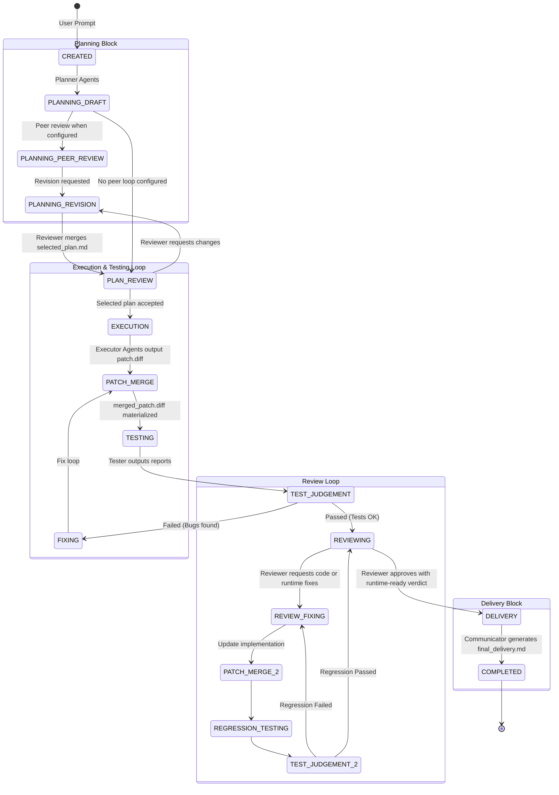

# OpenOrchestra Architecture and Flow

This document provides a comprehensive overview of the `OpenOrchestra` architecture and its core workflows.

## 1. System Architecture

The following diagram illustrates the current component boundaries after the orchestration refactor.

```mermaid
graph TD
    %% Users and CLI
    User((User)) --> |Prompt / Command| CLI[Interactive CLI / main.py]
    
    %% Core Orchestration
    CLI --> |Classify Prompt| WC[Workflow Classifier]
    CLI --> |Create Task| ORCH[Orchestrator Facade]
    CLI --> |Optional Web UI| UI[UI Server]
    
    subgraph "Core Orchestration"
        ORCH
        WF[Workflow Engine]
        RUN[Agent Phase Runner]
        TG[Test Gate Service]
        PG[Patch Gate Service]
        MAT[Materialized Repo Service]
        STAGE[Input Staging Service]
        WC
        JUDGE[Judge Runner]
    end

    ORCH --> WF
    ORCH --> RUN
    ORCH --> TG
    ORCH --> PG
    ORCH --> MAT
    ORCH --> STAGE
    ORCH --> JUDGE
    
    %% Resource Managers
    subgraph "Artifacts, State, and Contracts"
        SCHEMA[Artifact Schemas\nrequired outputs, output contracts, visibility rules]
        VIS[Visibility Policy]
        VAL[Artifact Validator]
        WM[Workspace Manager]
        AM[Artifact Manager]
        SR[State Repository]
        EV[Append-only Event Log]
    end
    
    WF --> SCHEMA
    RUN --> SCHEMA
    RUN --> STAGE
    STAGE --> VIS
    RUN <--> |Create isolated dirs| WM
    RUN <--> |Validate & Hash| VAL
    RUN <--> |Collect Artifacts| AM
    ORCH <--> |Persist DAG State| SR
    ORCH --> |Progress events| EV
    AM <--> |Read/Write| SR
    VIS --> SCHEMA
    TG --> AM
    TG --> MAT
    PG --> AM
    PG --> MAT
    MAT --> WM
    
    %% Adapters and Agents
    subgraph "Agent Adapters"
        AA_BASE{AgentAdapter}
        AA_CLAUDE[ClaudeCodeAdapter]
        AA_CODEX[CodexCLIAdapter]
        AA_HEADLESS[HeadlessCliAdapter]
        AA_MOCK[MockAgentAdapter]
        AA_BASE <|-- AA_CLAUDE
        AA_BASE <|-- AA_CODEX
        AA_BASE <|-- AA_HEADLESS
        AA_BASE <|-- AA_MOCK
    end
    
    RUN --> |Run Context| AA_BASE

    %% UI
    subgraph "UI Boundary"
        UI_API[ui/api.py]
        UI_STATE[ui/state_view.py]
        UI_HTML[ui/html.py]
        UI_TRANSLATE[ui/translation.py]
        UI --> UI_API
        UI_API --> UI_STATE
        UI_API --> UI_HTML
        UI_API --> UI_TRANSLATE
    end
    UI_STATE --> SR
    
    %% External Storage
    subgraph "Local File System"
        DB[(OpenOrchestra SQLite\nstate snapshots + event log)]
        FS_WS[workspaces/ \n Isolated Sandboxes]
        FS_ART[artifacts/ \n Versioned & Hashed]
        FS_DEL[deliver/ \n Final Output]
    end
    
    SR --> DB
    EV --> DB
    WM --> FS_WS
    AM --> FS_ART
    ORCH --> FS_DEL
    AA_BASE --> |Subprocess execution| FS_WS

    %% Styling
    classDef core fill:#f9f,stroke:#333,stroke-width:2px;
    classDef manager fill:#bbf,stroke:#333,stroke-width:1px;
    classDef storage fill:#ddd,stroke:#333,stroke-width:1px;
    class ORCH,WF,RUN,WC,VAL,JUDGE core;
    class WM,AM,SR,SCHEMA,VIS manager;
    class DB,FS_WS,FS_ART,FS_DEL storage;
```

### Boundary Notes

- `harness/workflow/engine.py` owns phase sequencing for new-project, bugfix, feature-change, and misc workflows.
- `harness/agents/runner.py` owns workspace creation, adapter calls, retry/timeout behavior, artifact collection, and output validation.
- `harness/artifacts/schemas.py` owns required outputs, role output-contract text, and the declarative visibility rule table.
- `harness/artifacts/visibility.py` interprets the schema visibility table for role/phase/round-specific input staging.
- `harness/context/staging.py` owns input artifact staging, manifest generation, tester target context, and failed-test-round context.
- `harness/gates/test_gate.py` owns Harness-run build/test command execution and test gate artifacts.
- `harness/gates/patch_gate.py` owns patch validation orchestration and patch/objective/materialized gate artifacts.
- `harness/materialization/service.py` owns source repo selection, materialized repo lookup, materialized workspace preparation, and repo metadata.
- `harness/state/repository.py` now stores both current state snapshots and append-only progress events for audit/replay diagnostics.
- `harness/ui/server.py` is only the web-server shell. API routing, state snapshots, HTML, file reads, and translation live in separate `harness/ui/*` modules.
- `harness/ui/html.py` loads static HTML/CSS/JS assets from `harness/ui/static/` and keeps the route contract unchanged.
- OpenOrchestra uses `~/.openorchestra.env` and `OO_*` variables as the current user-facing runtime config surface. `~/.myharness.env` and `HARNESS_*` are retained only as documented legacy aliases.

## 2. Core Workflow Lifecycle (New Project)

The following state diagram illustrates the dynamic lifecycle of a task undergoing the full `NEW_PROJECT` workflow, which is the most comprehensive execution path involving planning, execution, testing, and review loops.


