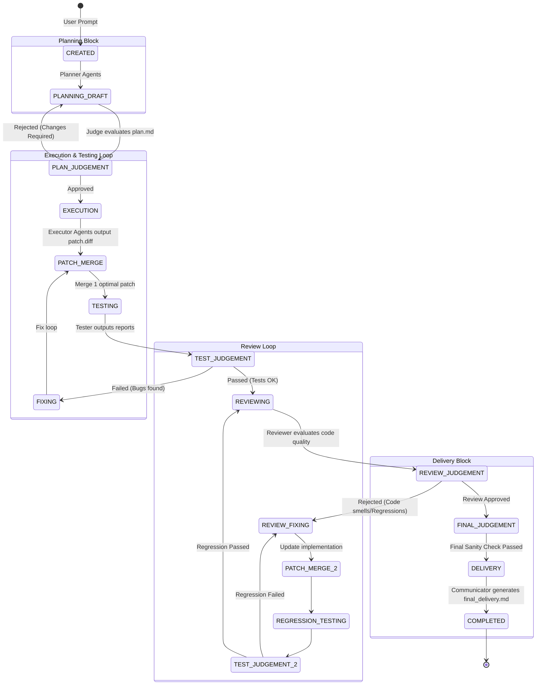

# OpenOrchestra Architecture and Flow

This document provides a comprehensive overview of the `OpenOrchestra` architecture and its core workflows.

## 1. System Architecture

The following diagram illustrates the static relationship between the core components, resource managers, agent adapters, and the local file system.

```mermaid
graph TD
    %% Users and CLI
    User((User)) --> |Prompt / Command| CLI[Interactive CLI / main.py]
    
    %% Core Orchestration
    CLI --> |Classify Prompt| WC[Workflow Classifier]
    CLI --> |Create Task| ORCH[Orchestrator]
    
    subgraph "Core Harness Engine"
        ORCH
        WC
        VAL[Artifact Validator]
        JUDGE[Judge Runner]
        COMM[Communicator]
    end
    
    %% Resource Managers
    subgraph "Resource Managers"
        WM[Workspace Manager]
        AM[Artifact Manager]
        SR[State Repository]
    end
    
    ORCH <--> |Create isolated dirs| WM
    ORCH <--> |Validate & Hash| AM
    ORCH <--> |Persist DAG State| SR
    AM <--> |Read/Write| SR
    
    %% Adapters and Agents
    subgraph "Agent Adapters"
        AA_BASE{AgentAdapter}
        AA_CLAUDE[ClaudeCodeAdapter]
        AA_CODEX[CodexCLIAdapter]
        AA_MOCK[MockAgentAdapter]
        AA_BASE <|-- AA_CLAUDE
        AA_BASE <|-- AA_CODEX
        AA_BASE <|-- AA_MOCK
    end
    
    ORCH --> |Run Context| AA_BASE
    
    %% External Storage
    subgraph "Local File System"
        DB[(harness.db SQLite)]
        FS_WS[workspaces/ \n Isolated Sandboxes]
        FS_ART[artifacts/ \n Versioned & Hashed]
        FS_DEL[deliver/ \n Final Output]
    end
    
    SR --> DB
    WM --> FS_WS
    AM --> FS_ART
    COMM --> FS_DEL
    AA_BASE --> |Subprocess execution| FS_WS

    %% Styling
    classDef core fill:#f9f,stroke:#333,stroke-width:2px;
    classDef manager fill:#bbf,stroke:#333,stroke-width:1px;
    classDef storage fill:#ddd,stroke:#333,stroke-width:1px;
    class ORCH,WC,VAL,JUDGE,COMM core;
    class WM,AM,SR manager;
    class DB,FS_WS,FS_ART,FS_DEL storage;
```

## 2. Core Workflow Lifecycle (New Project)

The following state diagram illustrates the dynamic lifecycle of a task undergoing the full `NEW_PROJECT` workflow, which is the most comprehensive execution path involving planning, execution, testing, and review loops.


